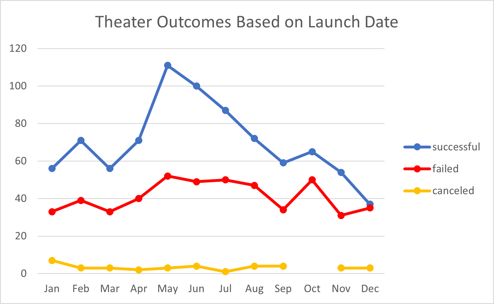
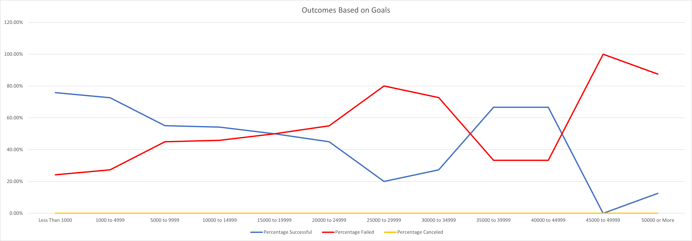

# An Analysis of Kickstarter Campaigns

## Overview of Project

### Purpose
	
  Our customer wants to organize a Kickstarter campaign for the play that she is wanting to get funding for. She has asked us to create an analysis for her to be able to compare 
  other campaigns in the same industry and see how successful they were in securing funding. The purpose of this analysis was to use data from Kickstarters website and organize
  and visualize how different campaigns fared in relation to their launch dates and their funding goals.

## Analysis and Challenges	

### Analysis of Outcomes Based on Launch Date
  
  To analyze the Outcomes Based on Launch Date, we started by creating a new worksheet to create a pivot table. We added a new column on the original Kickstarter page and 
  labeled it years. We then used the =Year() function to extract the data from the goal column (S) and visualize it as the year. Example: =Year(S2). We then went to the new 
  worksheet and created a pivot table and filtered it by Parent Category and Years. Columns were organized by outcomes and rows organized by Launch date, specifically months. 
  To group the Launch date by months we used a method found on Microsoft linked below. In the sum of Values filter we used the count of outcomes and used the pivot charting tool 
  to create a line graph with markers to visualize the data that was organized. 
  
	 
 - Pivot table grouping link: https://support.microsoft.com/en-us/office/group-or-ungroup-data-in-a-pivottable-c9d1ddd0-6580-47d1-82bc-c84a5a340725?ui=en-us&rs=en-us&ad=us

### Analysis of Outcomes Based on Goals

  To analyze the Outcomes Based on Goals, specific to plays, we started by creating a worksheet with with 8 columns and 12 rows to hold the date. The columns were created to
  show the number of outcome by types (successful, failed or canceled) and the percentages of those outcomes when divided by the total of each outcome. The rows split up the 
  data in 12 different intervals, from >1000, 1000 to 4999, 5000 to 9999,...etc, and finally <50000. We needed to retrieve the data from the Kickstarters worksheet and count the 
  number of plays that fit in to each data box to come up with the analysis, to do this we used countifs() statements. This was found on Microsofts website and is linked below. 
  An example:=COUNTIFS(Kickstarter!$D:$D, ">=1000", Kickstarter!$D:$D, "<=4999", Kickstarter!$F:$F, "successful", Kickstarter!$R:$R,"plays"). In the countifs statement 
  we had to use criteria in the statement to bring the data in to the correct cell. In this example the first criteria was (Kickstarter!$D:$D, ">=1000", Kickstarter!$D:$D). This 
  was used to fisrt search the data in the Kickstarter worksheet's D column (goals) to find the plays whose goal amount was more than $1000 and less than $4999. 
  The next criteria was (Kickstarter!$F:$F, "successful"), this was used so that the the countifs() would now look for the data that fell into the previous criteria and look for 
  the data points that were also successful. The final criteria was (Kickstarter!$R:$R,"plays"), this was used so that the the countifs() would now look for the data that fell 
  into the previous two criteria and also the data that were specifically plays and place the data into the cell. After finding all the data for the successful, failed and 
  canceled outcomes, the 4th column was the toatal of each outcome. This was found by adding outcomes in their respective rows (separeted by goal amounts) using the =sum() 
  statement. An example: =sum(B2+B3+B4). To find the percentage of each outcome, we divided the number of outcomes in their respective success rate by the total amount of 
  outcomes in their goal amount. To avoid any errors, because we had some plays that didn't fall in any of the criteria, we used the formula =IFERROR(). An example of this was 
  =IFERROR(B2/E2,0). This formula was found on Microsoft's website and is linked below. Now with all of the data cells filled we were able to visualize the data that we 
  recieved. We did this by creating a line chart of the Percentage of outcomes on the y-axis and the goal amounts on the x-axis. 
  
	
  - countifs() link: https://support.microsoft.com/en-us/office/countifs-function-dda3dc6e-f74e-4aee-88bc-aa8c2a866842?ui=en-us&rs=en-us&ad=us
- iferror() link: https://support.microsoft.com/en-us/office/iferror-function-c526fd07-caeb-47b8-8bb6-63f3e417f611#:~:text=You%20can%20use%20the%20IFERROR,the%20result%20of%20the%20formula. 

### Challenges and Difficulties Encountered
	
  The biggest challenge that I had to over come was the COUNTIFS() statements process on the Outcomes Based on Goals analysis. The first time I tried it I mistakenly used the 
  "Pledged" column ($D) instead of the Goal column ($E) and did not realize that it was wrong until I made a chart showing the data points. I could not figure out what I had 
  done wrong; I believed that it was the an issue with the data in the Kickstarter sheet and ended up redoing the entire Deliverable 2 process on a new Kickstarter Challange 
  excel sheet just to come up with the same issue. When I reread the instruction it dawned on me and I had a little laugh and corrected the problem. Going forward I 
	will make sure to pay a lot more attention to the instructions and double check as I go through each step of the process to avoid making simple errors as such. 
	
  Another difficulty that I encountered was creating the pivot table for the Outcomes Based on Launch Date correctly to show the months of the year and to organize the row in 
  the order that was required for the analysis. After a quick google search I was able to find out how to organize it on the Microsoft website and complete it correctly. 

## Results

- What are two conclusions you can draw about the Outcomes based on Launch Date?
	
	- The most successful month to launch a Theatre kickstarter goal is in the month of May, or start of the summer time. 
	- The probablity of success for Theatre kickstarter goals lowers as you get closer towards the end of the year.   

- What can you conclude about the Outcomes based on Goals?

	- Plays that have goal amounts under $5000 dollars show a higher rate of success than other goal amounts. The percent chance of success decreases as you raise the goal amount, except for at the goal amounts set at $35,000 to $44,999. I believe there are not enough Kickstarter attempts at these goal amounts, only 9, to make those data points reputable.   

- What are some limitations of this dataset?

	- The biggest limitation of this data set is that these data only have info up to the year 2017, they are outdated. If the customer were to use this data to support her decision to fund a play today, in 2022, the data we have would not accurately represent the current success rate in plays. In order to paint a more accurate picture for the customer we would have to retrieve Kickstarter data from the years 2018 to now to better represent what is happening now.
	- Another limitation is that this dataset only has data from the Kickstarter website, when there are other ways to fund projects like GoFundMe and Indiegogo. To give the customer an analysis that shows data from other similar funding websites could allow the customer to make a more informed decision on the way they go about funding their play.  

- What are some other possible tables and/or graphs that we could create?
	
	A graph that could be created to represent the data in this analysis better would be a bar graph of the Success Rate of Plays vs the Goal Amount. It would give a more accurate representation of the amount of Plays that attempted Kickstarters and showed success or failure. The Outcomes Based on Goals chart didn't visualize the success rate very well because the charted lines were just inverses of one another. 
	Another graph that could have been created to better represent the data would be Play Outcomes Based on Launch Dates instead of general theatres. It focuses in on the specific type of theatre event that the customer is trying to fund and give her a more accurate representation of her specific scenario. 
